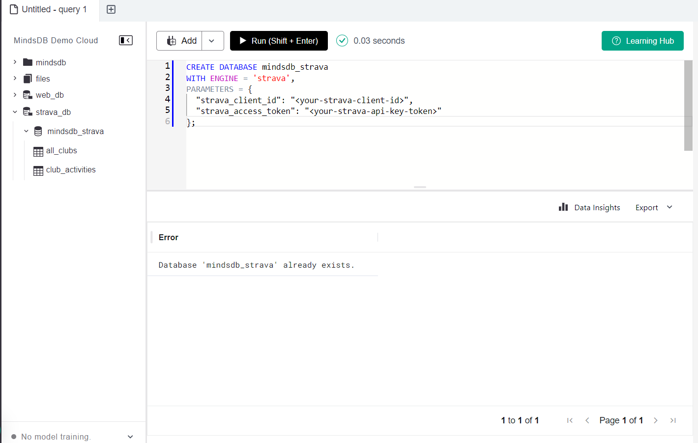
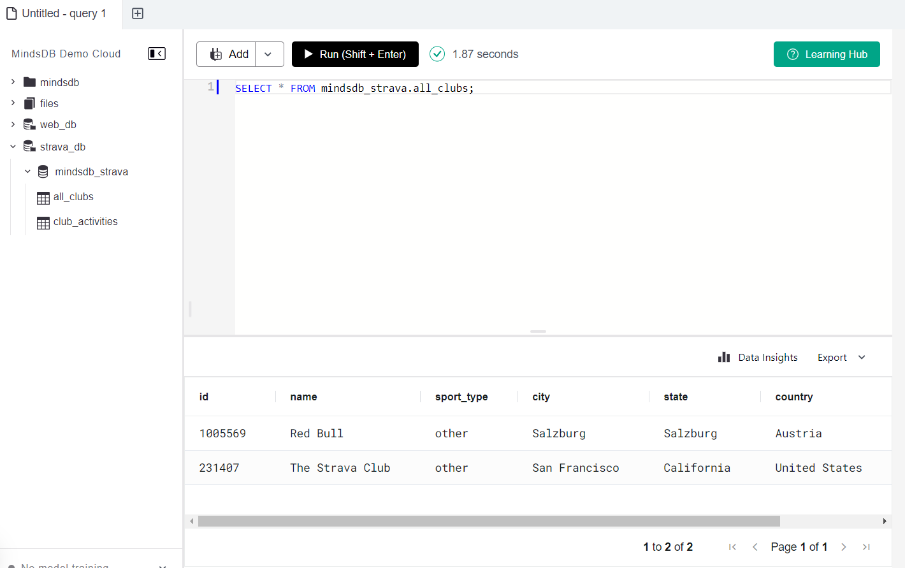
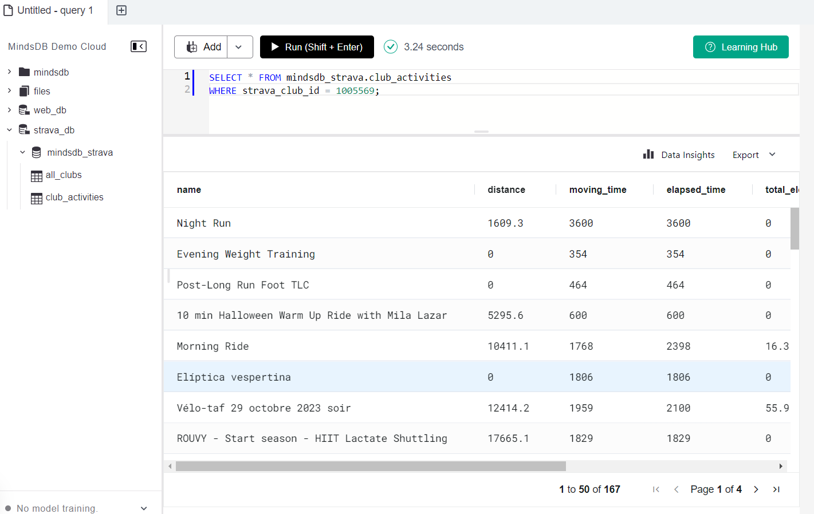
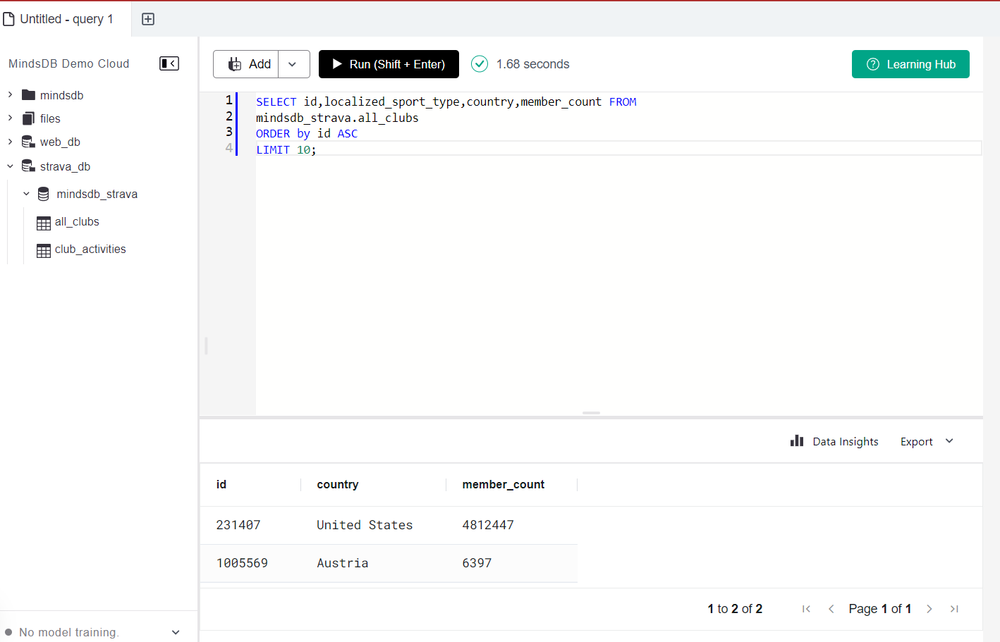
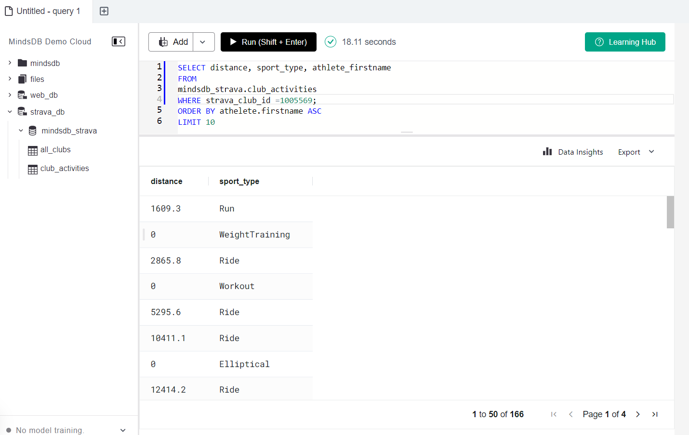

# Testing Strava App Integration

This README provides instructions for testing the Strava App integration in MindsDB.

For more details, refer to the related [GitHub Issue](https://github.com/mindsdb/mindsdb/issues/8150).

## Test Cases MindsDB Starva App

**Description:**
### 1. This create a database with the new Strava engine. 

```
CREATE DATABASE mindsdb_strava
WITH ENGINE = 'strava',
PARAMETERS = {
  "strava_client_id": "<your-strava-client-id>",
  "strava_access_token": "<your-strava-api-key-token>"  
};    


```
**Screeshot Result: Query successfull**



-----

### 2.  You can Use the established connection to query the Strava all_clubs table

```
SELECT * FROM mindsdb_strava.all_clubs;
   
```
**Screeshot Result: Query succssfull**



-----

### 3. you can  use the established connection to query the Strava club_activities table

```
SELECT * FROM mindsdb_strava.club_activities
WHERE strava_club_id = 158786;

```
**Screeshot Result: Query successfull**



-----

### 4.Advanced queries for the confluence handler

```
SELECT id,localized_sport_type,country,member_count FROM 
mindsdb_strava.all_clubs
ORDER by id ASC
LIMIT 10;

```

**Screeshot Result:  successfull**



-----

### 5.Advanced queries for the confluence handler

```
SELECT distance, sport_type, athlete_firstname
FROM
mindsdb_strava.club_activities
WHERE strava_club_id = 158786;
ORDER BY athelete.firstname ASC
LIMIT 10

```


-----

**Screeshot Result:  successfull**

## Result
The Strava_app integration has been  tested, and all test cases are passing.